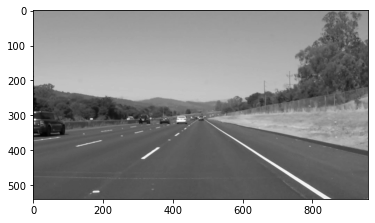
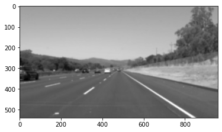
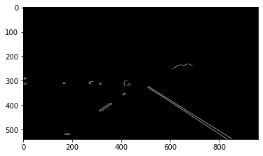
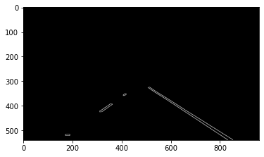
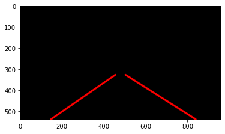
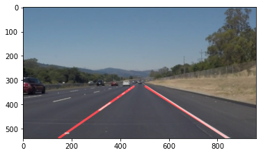

# **Finding Lane Lines on the Road** 

Overview
---

When we drive, we use our eyes to decide where to go.  The lines on the road that show us where the lanes are act as our constant reference for where to steer the vehicle.  Naturally, one of the first things we would like to do in developing a self-driving car is to automatically detect lane lines using an algorithm.

The goal of this project includes the following:

1. Write code that includes a pipeline to identify and draw the lane lines on a few test images using Python and OpenCV. Once you can successfully identify the lines in an image, then cut and paste to put together the code into the block provided to run on a video stream. 
2. Improve `draw_line()` in the pipeline so that the output draws solid lines over left and right lane lines, drawing from the bottom of the image extending out to the top of the region of interest.
3. (optional) Run the code on a challenge video and see if it can still properly find the lane lines.

Pipeline Description
---
The pipeline consists of the following steps:

1. Convert image into grayscale.

2. Apply gaussian smoothing to prepare for Canny transform.

3. Set parameters and use `canny` function for edge detection to detect lane lines.

4. Define a four-sided polygon to mask the image and show only a region of interest that includes the lane lines.

5. Set Hough transform parameters and run `Hough_lines` function on edge-detected masked image.

6. Superimpose Hough lines on original image.

To draw a single line on the left and right lanes, I modified the `draw_lines()` function by 

- separating left vs right line segments
- getting gradients `m` and intercepts `b` for each line segments
- averaging the coordinates of each of the line segments and extrapolate the lines to the top and bottom of the lane in the region of interest

Shortcomings
---
- Hough lines shown on video streams are jittery.
- When the contrast between road surface and lane line is reduced, e.g. lane line marking on concrete road (compared to lane marking on black aspalt), the pipeline has difficulty finding the lane lines.  This shortcoming is shown in "challenge" video.

Possible Improvements
---
- To reduce jitteriness, take averages of Hough line coordinates from `draw_lines()` over multiple frames (i.e. average over several passes of lane extrapolation) from the video stream to smooth out the hough lines superimposed on the video image.
- Use additional tools for parameter tuning to find optimal parameters for canny edge detection and Hough transform.

